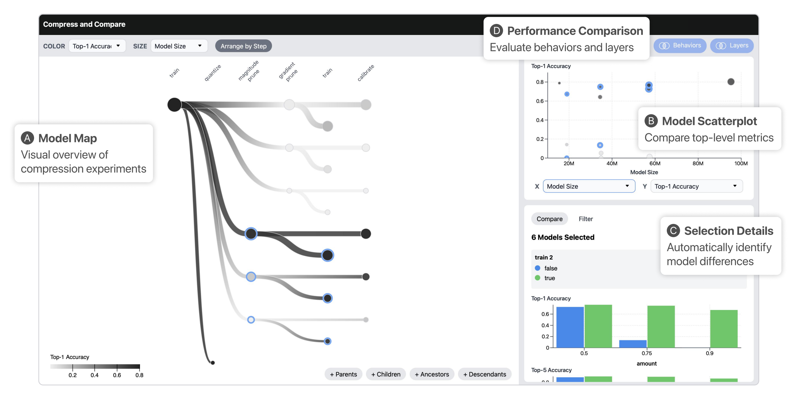

# Compress and Compare

Compress and Compare is a tool that helps you generate, track, and inspect machine learning model compression experiments.
Compress and Compare surfaces promising compression strategies by visualizing provenance relationships between compressed models and reveals compression-induced behavior changes by comparing models' predictions, weights, and activations.



This code accompanies the research paper:

**Compress and Compare: Interactively Evaluating Efficiency and Behavior Across ML Model Compression Experiments**  
Angie Boggust, Venkatesh Sivaraman, Yannick Assogba, Donghao Ren, Dominik Moritz, Fred Hohman  
*IEEE Transactions on Visualization and Computer Graphics (TVCG). St. Pete Beach, Florida, 2025.*  
Paper: https://arxiv.org/abs/2408.03274

## Run Locally and Development Setup

The setup requires two components: (1) a model server and (2) a client interface. The two are run on separate servers, so the model server can run on any remote instance through SSH tunneling.

### Model Server

On the machine running the model server, install PyTorch using either conda or pip. Then install the package and any remaining dependencies:

```bash
cd model_server
pip install -e .
```

Then write a module that calls `interactive_compression.server.start_flask_server` with information about the models you want to display.

For examples of how these modules can look, please refer to the `model_server/examples` directory of this repository. It contains the following examples:

- **CIFAR10 image classification.** Run `cifar10_image_classification/cifar10_image_classification.py` to start a debug-mode model server showing metadata about CIFAR10 image classification models. Due to space constraints, the models and data need to be loaded separately.
- **ImageNet image classification.** The `imagenet_image_classification` directory contains information about models used in the Compress and Compare user study. To show models as seen by participants in each part of the study, run the `imagenet_image_classification.py` script with a `-m` parameter set to either `tutorial`, `part1`, or `part2`. This server runs in non-debug mode by default.
- **Training T5 on SQuAD.** To create and evaluate T5-Large models on the SQuAD dataset, run `python t5_squad/make_t5_models.py`. With a GPU, evaluation takes about 18 minutes per model. You can then show these models by running the `run_server_t5.py` script. This server runs in non-debug mode by default.
- **CelebA blonde classification.** Run `celeba_blonde_classification/celeba_blonde_classification.py` to start a non-debug-mode model server showing metadata about CelebA blonde classification models. The models and data need to be loaded separately.

Any of the above servers can be changed to run in debug or non-debug mode (debug mode includes auto-reload and only allows traffic on localhost, while non-debug mode utilizes eventlet and can receive traffic from anywhere) by changing the `debug` parameter on the `start_flask_server` call.

### Client Interface

To start the client interface, first install dependencies:

```bash
cd comparison_interface
npm install
```

Then run the client hot-reload server:

```bash
npm run dev
```

The dashboard should now be visible at [`localhost:5173`](http://localhost:5173).

By default the client connects to a model server located at `http://localhost:5001`. You can also connect the client to a different URL, such as a remote host, by clicking the **Connect to Model...** button in the top right of the web interface. Make sure that if running a model server remotely using Flask, you open your instance to incoming traffic by setting the `debug` parameter to `False` in your call to `start_flask_server`, and enable traffic on the selected port using something like `sudo ufw allow <PORT>` on your instance.

## Contributing

When making contributions, refer to the [`CONTRIBUTING`](CONTRIBUTING.md) guidelines and read the [`CODE OF CONDUCT`](CODE_OF_CONDUCT.md).

## BibTeX

To cite our paper, please use:

```bibtex
@article{boggust2025compress,
  title={{Compress and Compare:} Interactively Evaluating Efficiency and Behavior Across ML Model Compression Experiments},
  author={Boggust, Angie and Sivaraman, Venkatesh and Assogba, Yannick and Ren, Donghao and Moritz, Dominik and Hohman, Fred},
  journal={IEEE Transactions on Visualization and Computer Graphics},
  year={2025},
  publisher={IEEE},
  doi={10.1109/TVCG.2024.3456371}
}
```

## License

This code is released under the [`LICENSE`](LICENSE) terms.
